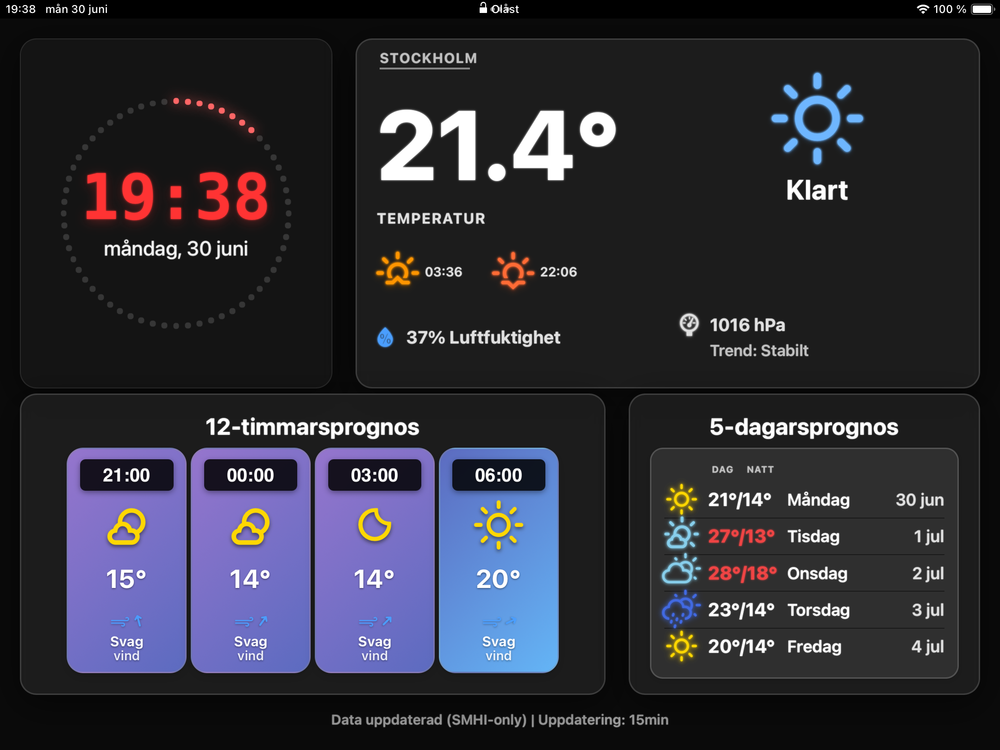

# 🌤️ Flask Weather Dashboard - Komplett Installationsguide

**GitHub Repository:** [https://github.com/cgillinger/vaderdisplay](https://github.com/cgillinger/vaderdisplay)

En modern, responsiv väder-dashboard som fungerar på alla skärmstorlekar och enheter. Visar väderprognos från SMHI med valfri integration av Netatmo väderstation för faktiska mätningar. **Nytt: Weather Effects med animerade regn- och snöeffekter!**



## 🎯 Vad behöver jag?

### 📊 Scenario 1: Server + Surfplatta/Telefon (REKOMMENDERAT)

**🖥️ Server (kör dashboarden):**
- Raspberry Pi, Linux-dator eller Synology NAS
- Python 3.8+ och internetanslutning
- **Inga skärm eller webbläsare behövs**

**📱 Klient (visar dashboarden):**
- iPad, Android-platta, telefon eller dator
- Modern webbläsare (Safari, Chrome, Firefox)
- WiFi-anslutning till samma nätverk

### 🖥️ Scenario 2: Allt-i-ett (Pi + skärm)

**📺 Dedikerad display:**
- Raspberry Pi 3B eller bättre
- 15.6" skärm (LP156WH4 eller liknande)
- Chromium för kioskläge
- Tangentbord/mus för konfiguration

## ⚡ Snabbstart

### 🖥️ Server-installation (5 minuter)

**Linux/Ubuntu/Raspberry Pi:**
```bash
sudo apt update && sudo apt install python3 python3-pip git -y
cd ~ && git clone https://github.com/cgillinger/vaderdisplay.git && cd vaderdisplay
pip3 install flask requests
cp reference/config_example.py reference/config.py
python3 app.py
```

**Synology NAS:**
```bash
python3 -m pip install --user flask requests
cd ~ && git clone https://github.com/cgillinger/vaderdisplay.git && cd vaderdisplay
cp reference/config_example.py reference/config.py && python3 app.py
```

**📱 Öppna sedan:** `http://SERVER-IP:8036` på din surfplatta/telefon

## 📋 Innehållsförteckning

- [Översikt](#-översikt)
- [Funktioner](#-funktioner)
- [Vad behöver jag?](#-vad-behöver-jag)
- [Server-installation](#-server-installation)
- [Klient-setup](#-klient-setup)
- [Konfiguration](#-konfiguration)
- [Weather Effects](#-weather-effects)
- [Användning](#-användning)
- [Anpassningar](#-anpassningar)
- [Felsökning](#-felsökning)
- [Support](#-support)

## 🎯 Översikt

Flask Weather Dashboard är en elegant väder-dashboard som kombinerar SMHI:s väderprognos med valfri integration av Netatmo väderstation. Systemet fungerar i **server/klient-arkitektur** - servern kan köras på vilken Linux-enhet som helst (Raspberry Pi, Synology NAS, Ubuntu-dator) medan dashboarden visas på surfplattor, telefoner eller dedikerade skärmar.

### 🌟 Två driftlägen:

**📊 SMHI-only (REKOMMENDERAT för nybörjare)**
- ✅ Fungerar direkt utan extra konfiguration
- ✅ Visar väderprognos från SMHI
- ✅ Luftfuktighet från SMHI:s observationer
- ✅ Enkel trycktrend baserad på SMHI-data

**🏠 SMHI + Netatmo (För avancerade användare)**
- ✅ Allt från SMHI-only-läget PLUS:
- ✅ Faktisk temperatur från din Netatmo-väderstation
- ✅ CO2-mätning och luftkvalitet
- ✅ Avancerad trycktrend baserad på historiska data
- 🔧 Ljudnivå-mätning (backend-stöd finns, frontend ej aktiverat)

## ✨ Funktioner

### 🌡️ Väderdata
- **SMHI Väderprognos**: 12-timmars och 5-dagars prognoser
- **Aktuell Temperatur**: Från SMHI eller Netatmo
- **Luftfuktighet**: SMHI observationer eller Netatmo
- **Lufttryck**: Med intelligent trycktrend-analys
- **Vinddata**: Med flera enhetsalternativ (svensk land/sjöterminologi, Beaufort, m/s, km/h)
- **Nederbörd**: Prognoser med regnintensitet

### 🎨 Visuella funktioner
- **Cirkulär klocka**: 60 LED-prickar som visar sekunder
- **Responsiv design**: Optimerad för alla skärmstorlekar
- **Teman**: Mörkt (produktionsklart) och ljust tema
- **Weather Icons**: Professionella väderikoner med dag/natt-varianter
- **Glassmorphism**: Modern glaseffektsdesign

### 🌦️ Weather Effects 
- **🌧️ Regn-animationer**: Realistiska regndroppar med vindpåverkan
- **❄️ Snö-effekter**: Fallande snöflingor med sparkle-effekter
- **⚡ SMHI-integration**: Automatiska effekter baserat på vädersymboler (1-27)
- **🎛️ Konfigurerbar intensitet**: Light, medium, heavy eller auto-detektering
- **🖥️ LP156WH4-optimerad**: 60fps animationer optimerade för specifik skärm
- **🚀 GPU-acceleration**: Pi5-optimerad för smooth prestanda
- **🎚️ Anpassningsbar**: Konfigurerbart antal partiklar och hastigheter

### 🌅 Extra funktioner
- **Sol-tider**: Soluppgång/solnedgång med API eller fallback-beräkning
- **Luftkvalitet**: CO2-mätning (endast med Netatmo)
- **Ljudnivå**: Decibel-mätning (backend-stöd finns, frontend ej aktiverat)
- **Auto-uppdatering**: Konfigurerbara uppdateringsintervall

## 🖥️ Server-installation

Servern kör Flask-applikationen och hanterar all väderdata. **Ingen skärm eller webbläsare behövs på servern.**

### 💻 Systemkrav för server

- **Linux-distribution** (Ubuntu, Debian, Raspberry Pi OS, Synology DSM)
- **Python 3.8+**
- **2GB+ RAM** (rekommenderat)
- **1GB lagringsutrymme**
- **Internetuppkoppling** för SMHI API

### 🐧 Linux Server (Ubuntu/Debian/Pi OS)

#### Steg 1: Förbered systemet

```bash
sudo apt update && sudo apt upgrade -y
sudo apt install python3 python3-pip git curl nano -y
```
*Uppdaterar systemet och installerar grundläggande verktyg. **OBS:** Ingen Chromium behövs på servern.*

#### Steg 2: Ladda ner och installera

```bash
cd ~
git clone https://github.com/cgillinger/vaderdisplay.git
cd vaderdisplay
pip3 install flask requests
```
*Laddar ner dashboarden och installerar Python-beroenden.*

#### Steg 3: Konfigurera

```bash
cp reference/config_example.py reference/config.py
nano reference/config.py
```
*Skapar konfigurationsfil. Se [Konfiguration](#-konfiguration) för detaljer.*

#### Steg 4: Testa och starta

```bash
python3 app.py
```
*Startar servern på port 8036. Servern är nu redo för klienter.*

#### Steg 5: Autostart (valfritt)

```bash
# Skapa systemd-service för autostart
sudo tee /etc/systemd/system/weather-dashboard.service > /dev/null <<EOF
[Unit]
Description=Weather Dashboard
After=network.target

[Service]
Type=simple
User=$USER
WorkingDirectory=$HOME/vaderdisplay
ExecStart=/usr/bin/python3 app.py
Restart=always

[Install]
WantedBy=multi-user.target
EOF

sudo systemctl enable weather-dashboard
sudo systemctl start weather-dashboard
```
*Konfigurerar automatisk start vid systemstart.*

### 🏢 Synology NAS Server

#### Steg 1: Förbered Synology

1. **DSM** → **Paketcenter** → Installera **Python 3**
2. **Kontrollpanel** → **Terminal & SNMP** → Aktivera **SSH-tjänst**
3. **Anslut via SSH:** `ssh admin@SYNOLOGY-IP`

#### Steg 2: Installera server

```bash
python3 -m pip install --user flask requests
cd ~
git clone https://github.com/cgillinger/vaderdisplay.git
cd vaderdisplay
cp reference/config_example.py reference/config.py
nano reference/config.py
```
*Installerar Python-moduler och sätter upp projektet. **OBS:** Ingen Chromium behövs på Synology.*

#### Steg 3: Testa server

```bash
python3 app.py
```
*Startar servern. Testa genom att öppna `http://SYNOLOGY-IP:8036` på annan enhet.*

#### Steg 4: Autostart via DSM

1. **DSM** → **Kontrollpanel** → **Uppgiftsschema**
2. **Skapa** → **Användardefinierad script**
3. **Användare**: Ditt användarnamn
4. **Script:** 
   ```bash
   cd ~/vaderdisplay && python3 app.py
   ```
5. **Schema**: **När systemet startar**

### ✅ Server-installation klar

**Servern körs nu på:** `http://SERVER-IP:8036`

**Nästa steg:** [Klient-setup](#-klient-setup) för att visa dashboarden på surfplattor/skärmar.

## 📱 Klient-setup

Klienter visar dashboarden från servern. Fungerar på alla enheter med modern webbläsare.

### 📊 Klient-systemkrav

- **Modern webbläsare** (Safari, Chrome, Firefox, Edge)
- **WiFi-anslutning** till samma nätverk som servern
- **Minst 1024×768 upplösning** (fungerar på alla storlekar)

### 📱 iPad Webbapp-installation

**Perfekt för väggmonterad surfplatta eller köksvy!**


#### Steg för iPad:

1. **🌐 Öppna Safari** på iPad
2. **📍 Navigera** till `http://SERVER-IP:8036` (ersätt med din servers IP)
3. **📤 Tryck på delningsknappen** (kvadrat med uppåtpil)
4. **➕ Välj "Lägg till på hemskärmen"**
5. **✏️ Ändra namnet** till "Väder Dashboard"
6. **✅ Tryck "Lägg till"**

#### iPad-tips:
- **🔄 Landscape-orientering** rekommenderas för bästa upplevelse
- **🔒 Inaktivera Auto-Lock:** Inställningar → Skärm och ljusstyrka → Auto-Lock → Aldrig
- **🎯 Guided Access:** För kioskfunktionalitet (Inställningar → Tillgänglighet → Guided Access)
- **⚡ Weather Effects** fungerar smidigt på iPad Pro och nyare modeller

### 🤖 Android-platta Webbapp-installation

**Fungerar utmärkt på Samsung Galaxy Tab, Huawei, Lenovo och andra Android-plattor!**

#### Steg för Android (Chrome):

1. **🌐 Öppna Chrome** på Android-plattan
2. **📍 Navigera** till `http://SERVER-IP:8036`
3. **⋮ Tryck på menyn** (tre prickar, överst till höger)
4. **➕ Välj "Lägg till på startskärmen"** eller **"Installera app"**
5. **✏️ Ändra namnet** till "Väder Dashboard"
6. **✅ Tryck "Lägg till"**

#### Steg för Android (Samsung Internet):

1. **🌐 Öppna Samsung Internet**
2. **📍 Navigera** till `http://SERVER-IP:8036`
3. **≡ Tryck på menyn** (tre linjer)
4. **➕ Välj "Lägg till på startskärmen"**
5. **✅ Bekräfta installation**

#### Android-tips:
- **🔋 Inaktivera strömsparläge** för plattan när dashboarden körs
- **🌙 Nattläge:** Aktivera "Behåll skärmen på" under utvecklarinställningar
- **🎮 Kioskläge:** Använd appar som "Kiosk Browser Lockdown" för offentliga installationer
- **📱 Olika storlekar:** Fungerar på 7"-13" plattor, layout anpassas automatiskt

#### Rekommenderade Android-plattor:
- **Samsung Galaxy Tab A/S-serien** (bra prestanda för Weather Effects)
- **Lenovo Tab M-serien** (budget-vänlig, fungerar bra)
- **Huawei MatePad** (snabb, smooth animationer)
- **Amazon Fire HD** (budget-alternativ, fungerar med Chrome installerat)

### 🖥️ Dedikerad display-installation (Pi + skärm)

**För permanenta väggmonterade displayer eller informationstavlor.**

#### Display-systemkrav:

- **Raspberry Pi 3B eller bättre** (Pi5 rekommenderat för Weather Effects)
- **15.6" skärm** (LP156WH4 optimerat, men fungerar med alla storlekar)
- **Chromium webbläsare** för kioskläge
- **4GB+ SD-kort**

#### Steg 1: Förbered Pi för display

```bash
sudo apt update && sudo apt upgrade -y
sudo apt install python3 python3-pip git curl nano chromium-browser xorg -y
```
*Installerar både server-komponenter OCH Chromium för display.*

#### Steg 2: Installera dashboard-server

```bash
cd ~
git clone https://github.com/cgillinger/vaderdisplay.git
cd vaderdisplay
pip3 install flask requests
cp reference/config_example.py reference/config.py
nano reference/config.py
```
*Pi:n kör både server och klient lokalt.*

#### Steg 3: Konfigurera kioskläge

**Standard kioskläge:**
```bash
chromium-browser --kiosk --disable-infobars http://localhost:8036
```

**Pi5 med Weather Effects (optimerat):**
```bash
chromium-browser --kiosk --disable-infobars --enable-gpu-rasterization --enable-zero-copy --disable-web-security http://localhost:8036
```

**Pi3B (prestanda-optimerat):**
```bash
chromium-browser --kiosk --disable-infobars --memory-pressure-off --disable-dev-shm-usage http://localhost:8036
```

#### Steg 4: Autostart för display

```bash
# Skapa autostart-script
mkdir -p ~/.config/autostart
cat > ~/.config/autostart/weather-dashboard.desktop << 'EOF'
[Desktop Entry]
Type=Application
Name=Weather Dashboard
Exec=/bin/bash -c 'cd ~/vaderdisplay && python3 app.py & sleep 10 && chromium-browser --kiosk --disable-infobars http://localhost:8036'
Hidden=false
NoDisplay=false
X-GNOME-Autostart-enabled=true
EOF
```
*Startar både server och kiosk-display automatiskt.*

### 🔌 Hitta server-IP

**På server (Linux/Synology):**
```bash
ip addr show | grep 'inet 192' | awk '{print $2}' | cut -d'/' -f1
```
*Visar serverns IP-adress, t.ex. 192.168.1.100*

**På Windows-klient:**
```cmd
ping SERVERNAME.local
```
*Hitta server via namn, t.ex. raspberrypi.local*

## ⚙️ Konfiguration

Huvudkonfigurationen görs i `reference/config.py`. Kopiera från `config_example.py`:

### 🎯 Grundläggande inställningar

```python
CONFIG = {
    # Huvudinställning: SMHI-only eller SMHI+Netatmo
    'use_netatmo': False,  # Sätt till True om du har Netatmo
    
    'smhi': {
        # Koordinater för väderdata
        'latitude': 59.3293,   # Stockholm (ändra till din plats)
        'longitude': 18.0686,  # Stockholm
    },
    
    'display': {
        'location_name': 'Stockholm',  # Namn som visas på skärmen
    },
}
```

### 📍 Koordinater för svenska städer

| Stad | Latitud | Longitud |
|------|---------|----------|
| Stockholm | 59.3293 | 18.0686 |
| Göteborg | 57.7089 | 11.9746 |
| Malmö | 55.6050 | 13.0038 |
| Uppsala | 59.8586 | 17.6389 |
| Linköping | 58.4108 | 15.6214 |

### 🎨 Visuella inställningar

```python
'ui': {
    'theme': 'dark',  # 'light', 'dark', eller 'auto'
    'wind_unit': 'land',  # Se vindenheter nedan
    'refresh_interval_minutes': 15,  # SMHI uppdatering
    'netatmo_refresh_interval_minutes': 10,  # Netatmo uppdatering
}
```

### 💨 Vindenheter

| Enhet | Beskrivning | Exempel |
|-------|-------------|---------|
| `'land'` | Svensk landterminologi | Lugnt, Svag vind, Måttlig vind |
| `'sjo'` | Sjöterminologi | Stiltje, Bris, Kuling, Storm |
| `'beaufort'` | Beaufort-skala | Beaufort 0-12 |
| `'ms'` | Meter per sekund | 5.2 m/s |
| `'kmh'` | Kilometer per timme | 18 km/h |

### 🏠 Netatmo-konfiguration (valfritt)

**OBS:** Krävs ENDAST om `use_netatmo: True`

```python
'netatmo': {
    'client_id': 'DIN_NETATMO_CLIENT_ID',
    'client_secret': 'DIN_NETATMO_CLIENT_SECRET', 
    'refresh_token': 'DIN_NETATMO_REFRESH_TOKEN',
    'preferred_station': 'Utomhus',
},
```

**För att få Netatmo API-uppgifter:**
1. Gå till [https://dev.netatmo.com/apps](https://dev.netatmo.com/apps)
2. Skapa en ny app eller använd befintlig
3. Anteckna Client ID och Client Secret
4. Genomför OAuth-flow för refresh_token

### 🌅 Sol-tider (valfritt)

```python
'ipgeolocation': {
    'api_key': 'DIN_API_NYCKEL',  # Gratis från ipgeolocation.io
},
```

**För exakta sol-tider:**
1. Registrera dig på [https://ipgeolocation.io/](https://ipgeolocation.io/)
2. Få din gratis API-nyckel (1000 anrop/månad)
3. Lägg till i config

**Utan API-nyckel** används förenklad solberäkning (fungerar bra för Sverige).

## 🌦️ Weather Effects

### ✨ Funktioner

Weather Effects tillhandahåller **realistiska väderanimationer** som automatiskt aktiveras baserat på SMHI:s väderdata:

- **🌧️ Regn-effekter**: Animerade regndroppar med vindpåverkan
- **❄️ Snö-effekter**: Fallande snöflingor med sparkle-animationer  
- **⚡ SMHI-integration**: Automatisk aktivering baserat på vädersymboler (1-27)
- **🎛️ Intensitet**: Konfigurerbar eller auto-detektering från nederbörd
- **🖥️ LP156WH4-optimerad**: Specifikt optimerad för 1366×768 LED LCD-paneler
- **🚀 Prestanda**: 60fps GPU-accelererade animationer för Pi5

### ⚙️ Konfiguration

Lägg till i `reference/config.py`:

```python
CONFIG = {
    # ... övrig konfiguration ...
    
    # Weather Effects-konfiguration
    'weather_effects': {
        'enabled': True,  # True/False - Aktivera vädereffekter
        'intensity': 'auto',  # 'auto', 'light', 'medium', 'heavy'
        
        # Regn-inställningar
        'rain_config': {
            'droplet_count': 50,           # Antal regndroppar (10-100)
            'droplet_speed': 2.0,          # Fallhastighet (0.5-5.0)
            'wind_direction': 'none',      # 'none', 'left-to-right', 'right-to-left'
            'enable_splashes': False       # Vattenplask-effekter (experimentellt)
        },
        
        # Snö-inställningar  
        'snow_config': {
            'flake_count': 25,             # Antal snöflingor (10-50)
            'characters': ['*', '+'],      # Snöflingor-tecken
            'sparkle_enabled': False,      # Glitter-effekt på snöflingor
            'min_size': 0.8,              # Minsta storlek (0.5-2.0)
            'max_size': 1.5,              # Största storlek (1.0-3.0)
            'speed': 1.0                   # Fallhastighet (0.5-2.0)
        },
        
        # Tekniska inställningar
        'transition_duration': 1000,      # Övergångstid i ms (500-3000)
        'debug_logging': False,           # Detaljerad logging
        'fallback_enabled': True,         # Graceful fallbacks vid fel
        
        # LP156WH4-specifika optimeringar
        'lp156wh4_optimizations': {
            'enabled': True,               # Aktivera skärm-optimeringar
            'contrast_boost': 1.1,         # Kontrastförstärkning för LED LCD
            'brightness_boost': 1.1,       # Ljusstyrkeboost för bättre synlighet
            'gpu_acceleration': True,      # GPU-acceleration (Pi5)
            'target_fps': 60              # Mål-framerate
        }
    }
}
```

### 🎛️ Intensitetsnivåer

| Intensitet | Beskrivning | Användning |
|------------|-------------|------------|
| `'auto'` | **Rekommenderat** - Bestäms automatiskt från SMHI nederbörd | Mest realistisk |
| `'light'` | Lätta effekter med färre partiklar | Prestanda-sparläge |
| `'medium'` | Standard-intensitet | Balanserat läge |
| `'heavy'` | Intensiva effekter med många partiklar | Dramatisk effekt |

### 🌡️ SMHI Vädersymbol-mappning

Weather Effects aktiveras automatiskt baserat på SMHI:s vädersymboler:

| SMHI Symboler | Effekt | Beskrivning |
|---------------|--------|-------------|
| 1-7 | **Inget** | Klart väder, inga effekter |
| 8-10, 18-20 | **🌧️ Regn** | Regnskurar och regn |
| 11, 21 | **⚡ Åska** | Behandlas som intensivt regn |
| 12-14, 22-24 | **🌨️ Snöblandat** | Snö-effekter med regn-hastighet |
| 15-17, 25-27 | **❄️ Snö** | Snöbyar och snöfall |

### 🚀 Prestanda-optimering för olika enheter

**📱 Mobila enheter (iPad/Android):**
```python
'weather_effects': {
    'enabled': True,
    'rain_config': {'droplet_count': 35},   # Lagom för mobil
    'snow_config': {'flake_count': 20},     # Lagom för mobil
    'lp156wh4_optimizations': {
        'gpu_acceleration': True,            # Mobiler har GPU
        'target_fps': 45                     # Lite lägre för batterilivslängd
    }
}
```

**🖥️ Raspberry Pi 3B:**
```python
'weather_effects': {
    'enabled': True,
    'rain_config': {'droplet_count': 30},   # Reducerat för Pi3B
    'snow_config': {'flake_count': 15},     # Reducerat för Pi3B
    'lp156wh4_optimizations': {
        'gpu_acceleration': False,           # Inaktiverat för Pi3B
        'target_fps': 30                     # Lägre framerate
    }
}
```

**🚀 Raspberry Pi 5:**
```python
'weather_effects': {
    'enabled': True,
    'rain_config': {'droplet_count': 75},   # Fullt antal för Pi5
    'snow_config': {'flake_count': 40},     # Fullt antal för Pi5
    'lp156wh4_optimizations': {
        'gpu_acceleration': True,            # GPU-acceleration
        'target_fps': 60                     # Smooth 60fps
    }
}
```

### 🔧 API-endpoints för Weather Effects

**Konfigurations-API:**
```bash
curl http://SERVER-IP:8036/api/weather-effects-config
```
*Returnerar aktuell Weather Effects-konfiguration och SMHI-integration status.*

**Debug-API (kräver debug_logging: True):**
```bash
curl http://SERVER-IP:8036/api/weather-effects-debug
```
*Visar detaljerad mappning av SMHI-symboler till effekter för felsökning.*

### 🎨 Anpassning av effekter

**Ändra regn-färg (CSS):**
```css
.rain-particle {
    background: linear-gradient(to bottom, 
        rgba(0, 170, 255, 0.9) 0%, 
        rgba(0, 170, 255, 0.7) 50%, 
        transparent 100%);
}
```

**Ändra snö-tecken:**
```python
'snow_config': {
    'characters': ['❄', '❅', '❆', '*', '+', '·'],  # Fler snöflingor
}
```

**Vindpåverkad regn:**
```python
'rain_config': {
    'wind_direction': 'left-to-right',  # Diagonal regn
}
```

## 🚀 Användning

### 🖥️ Starta server

**Linux/Pi:**
```bash
cd ~/vaderdisplay
python3 app.py
```

**Synology:**
```bash
cd ~/vaderdisplay
python3 app.py
```

**Automatisk start:** Se autostart-instruktioner i installationssektionerna.

### 📱 Öppna på klienter

- **📍 Server-adress**: `http://SERVER-IP:8036`
- **🔍 Hitta IP**: Kör `ip addr` på servern
- **🏠 Lokalt (Pi+skärm)**: `http://localhost:8036`

### 🎮 Kioskläge-alternativ

**📺 Dedikerad Pi-display:**
```bash
chromium-browser --kiosk --disable-infobars http://localhost:8036
```

**📱 Android kioskläge:**
- Installera "Kiosk Browser Lockdown" från Google Play
- Konfigurera för `http://SERVER-IP:8036`

**🍎 iPad kioskläge:**
- Använd "Guided Access" (Inställningar → Tillgänglighet)
- Starta webapp och aktivera Guided Access

### 🔧 API-endpoints

**Aktuell väderdata:**
```bash
curl http://SERVER-IP:8036/api/current
```

**Weather Effects-konfiguration:**
```bash
curl http://SERVER-IP:8036/api/weather-effects-config
```

**Systemstatus:**
```bash
curl http://SERVER-IP:8036/api/status
```

**Trycktrend-data:**
```bash
curl http://SERVER-IP:8036/api/pressure_trend
```

### ⏹️ Stoppa server

**Ctrl+C** i terminalen eller hitta process:

```bash
# Hitta Flask-processen
ps aux | grep app.py

# Stoppa med process-ID
kill [PROCESS_ID]
```

## 🎛️ Anpassningar

### 🎨 Ändra tema

Redigera `reference/config.py`:

```python
'ui': {
    'theme': 'dark',  # eller 'light', 'auto'
}
```

### ⏱️ Ändra uppdateringsintervall

```python
'ui': {
    'refresh_interval_minutes': 15,  # 5-60 minuter
    'netatmo_refresh_interval_minutes': 10,  # 5-30 minuter
}
```

### 💨 Ändra vindenheter

```python
'ui': {
    'wind_unit': 'land',  # 'land', 'sjo', 'beaufort', 'ms', 'kmh'
}
```

### 🌦️ Anpassa Weather Effects

```python
'weather_effects': {
    'enabled': True,
    'intensity': 'medium',  # Fastställd intensitet
    'rain_config': {
        'droplet_count': 75,  # Fler regndroppar
        'wind_direction': 'left-to-right'  # Vindpåverkad regn
    }
}
```

### 🎨 Anpassad CSS

Redigera `static/css/styles.css` för visuella ändringar. CSS:en är optimerad för LP156WH4 (1366×768) men kan anpassas för andra skärmar.

Weather Effects-specifik CSS finns i `static/css/weather-effects.css`.

### 🔌 Ändra port

Redigera `app.py` längst ner:

```python
app.run(
    host='0.0.0.0',
    port=8036,  # Ändra till önskad port
    debug=False,
    threaded=True
)
```

## 🛠️ Felsökning

### 🔍 Vanliga problem och lösningar

#### 🚫 Server startar inte

**Systemkontroll:**
```bash
python3 --version  # Kräver 3.8+
python3 -c "import flask, requests; print('✅ Moduler OK')"
python3 -c "from reference.config import CONFIG; print('✅ Config OK')"
```

#### 🌐 Klient kan inte ansluta

**Nätverksdiagnostik:**
```bash
# På server
ip addr show | grep 'inet 192'
netstat -tulpn | grep :8036

# På klient  
ping SERVER-IP
curl http://SERVER-IP:8036/api/status
```

#### 📱 Weather Effects fungerar inte

**Weather Effects-diagnostik:**
```bash
curl -s http://SERVER-IP:8036/api/weather-effects-config | grep -E "(enabled|error)"
python3 -c "from reference.config import CONFIG; print('WE enabled:', CONFIG.get('weather_effects', {}).get('enabled', False))"
```

#### 🐌 Prestanda-problem

**För mobila enheter:**
```python
# I config.py - reducera partikelantal
'rain_config': {'droplet_count': 25}
'snow_config': {'flake_count': 15}
```

**För äldre Pi:**
```bash
# Aktivera GPU-minne
echo "gpu_mem=128" | sudo tee -a /boot/config.txt
sudo reboot
```

#### 🏠 Netatmo fungerar inte

**Snabb fix - använd SMHI-only:**
```bash
sed -i "s/'use_netatmo': True/'use_netatmo': False/" reference/config.py
python3 app.py
```

### 🔧 Debug-läge

**Aktivera detaljerad felsökning:**
```bash
cd ~/vaderdisplay
cp app.py app.py.backup
sed -i 's/debug=False/debug=True/' app.py
sed -i "s/'debug_logging': False/'debug_logging': True/" reference/config.py
python3 app.py
```

### 📊 Komplett systemkontroll

```bash
echo "=== Weather Dashboard Systemkontroll ==="
echo "System: $(uname -a)"
echo "Python: $(python3 --version)"
echo "Flask: $(python3 -c 'import flask; print(flask.__version__)' 2>/dev/null || echo 'EJ INSTALLERAT')"
echo "Nätverk: $(curl -s --max-time 5 https://api.smhi.se > /dev/null && echo 'OK' || echo 'PROBLEM')"
echo "Config: $(python3 -c 'from reference.config import CONFIG; print("OK")' 2>/dev/null || echo 'PROBLEM')"
echo "Weather Effects: $(python3 -c 'from reference.config import CONFIG; print("AKTIVERAT" if CONFIG.get("weather_effects", {}).get("enabled") else "INAKTIVERAT")' 2>/dev/null || echo 'CONFIG-FEL')"
echo "Port 8036: $(netstat -tuln | grep :8036 > /dev/null && echo 'UPPTAGEN' || echo 'LEDIG')"
```

## 🔧 Support

### 📚 Resurser

- **GitHub Issues**: [https://github.com/cgillinger/vaderdisplay/issues](https://github.com/cgillinger/vaderdisplay/issues)
- **Konfiguration**: `reference/config_example.py` har detaljerade kommentarer
- **API-dokumentation**: Tillgänglig via `/api/`-endpoints

### 🆙 Uppdateringar

**Backup och uppdatera:**
```bash
cd ~/vaderdisplay
cp reference/config.py reference/config.backup
git pull
cp reference/config.backup reference/config.py
python3 app.py
```

### 🔄 Återställning

**Backup och återställ:**
```bash
# Skapa backup
mkdir -p backup/$(date +%Y%m%d_%H%M%S)
cp reference/config.py backup/$(date +%Y%m%d_%H%M%S)/

# Återställ från backup
cp backup/DATUM_TID/config.py reference/
```

---

## 📄 Licens

Detta projekt är open source. Se LICENSE-filen för detaljer.

## 🙏 Tack till

- **SMHI**: För öppet väder-API
- **Netatmo**: För väderstation-API
- **Weather Icons**: För professionella väderikoner
- **Flask**: För robust webbramverk
- **MagicMirror Community**: För inspiration till Weather Effects-systemet

---

**🌤️ Lycka till med din väder-dashboard med Weather Effects!**

**📱 Perfekt för både surfplattor och dedikerade displayer!**